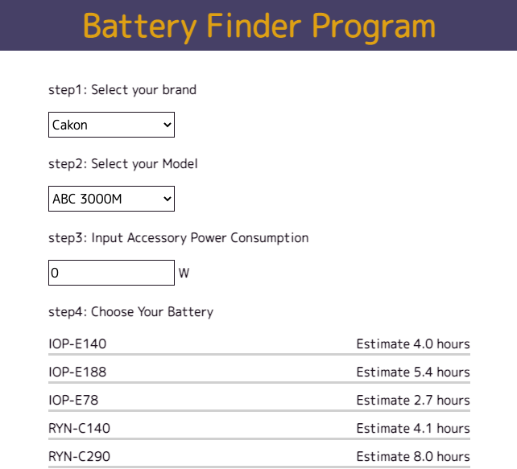

# rcs-battery-finder

Recursion Computer Science Project#2 Battery Finder Program

## 概要

-   カメラとアクセサリーの総消費電力に互換性のある電池を表示します。
-   使い方
    -   カメラのブランドとモデルを選択します。
    -   アクセサリーの消費電力を入力します（0〜100）。
    -   互換性のある電池の一覧と、満充電時の持続時間を表示します。

## 環境

-   HTML/CSS
-   BootStrap
-   JavaScript

## 作業時間

-   構成 0.5 時間
-   実装 2.0 時間
-   修正 0.5 時間
